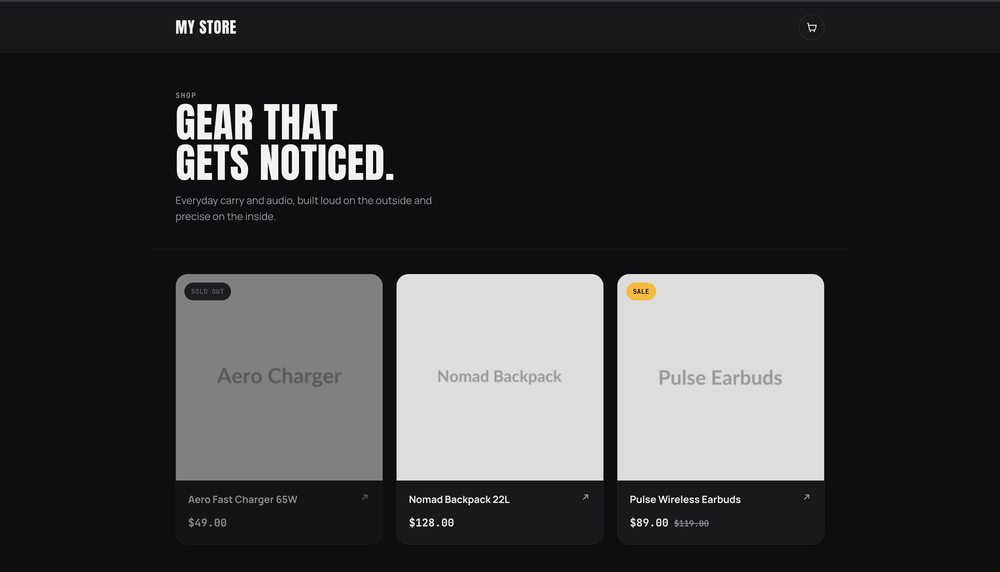
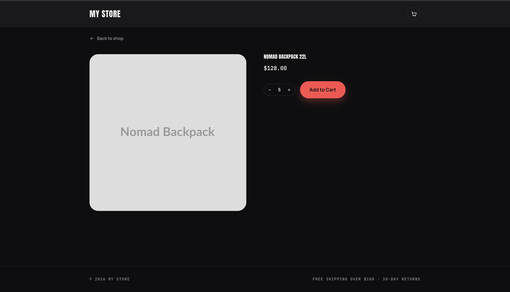
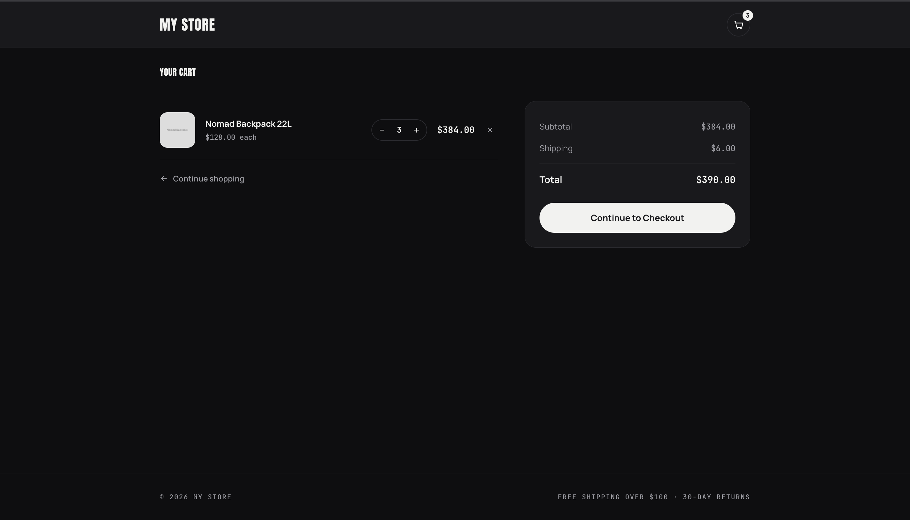
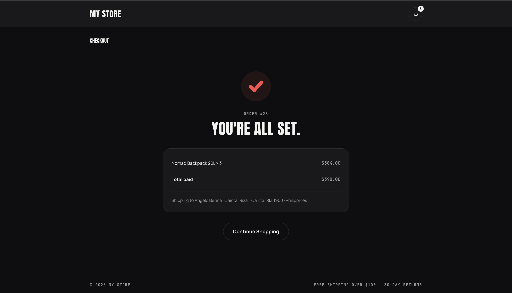

<p align="center"><strong>My Store</strong></p>

<p align="center">A shopper picks products, checks out with an address and card, and gets their order shipped.</p>

## Screenshots

The shopper flow described in [docs/PLAN.md](docs/PLAN.md): browse the catalog, view a product, review the cart, then check out.

| Catalog | Product detail |
|---|---|
|  |  |

| Cart | Order confirmation |
|---|---|
|  |  |

## Overview

An ecommerce storefront built as a decoupled AngularJS app embedded inside a WordPress + WooCommerce backend, rather than a stock WooCommerce/theme install. It's a portfolio/learning project — the full plan, scope decisions, and the reasoning behind each one live in [docs/PLAN.md](docs/PLAN.md).

## Stack

- **Backend** — WordPress via [Bedrock](https://roots.io/bedrock/) (Composer-managed, env-based config) + WooCommerce. The frontend talks only to WooCommerce's public Store API (`/wc/store/v1/...`) — never the admin REST API, which needs a Consumer Key/Secret and has no business being called from the browser.
- **Theme** — [TailPress](https://tailpress.io/) (`web/app/themes/tailpress`), a plain Underscores-style WP theme with Tailwind, chosen over Sage for having fewer moving parts to wire AngularJS into.
- **Frontend** — AngularJS 1.x, built via Vite and enqueued as the theme's own JS/CSS bundle (same origin, no CORS, no separately hosted SPA).
- **Payments** — Stripe (client-side Elements/Payment Element only — the server never sees a raw card number).
- **Tests** — [Pest](https://pestphp.com/) for feature tests, [Pint](https://laravel.com/docs/pint) for style.

### Why these choices

- **Embedded Angular over default WooCommerce templates** — the point of this project is the decoupled-frontend engineering, not a theme-and-plugins install. Every module calls the Store API directly instead of falling back to server-rendered WooCommerce markup.
- **AngularJS despite being EOL** (no security patches since Jan 2022) — a deliberate choice, kept because it's the framework being demonstrated here, not because it's the "right" pick for a new project today.
- **Hybrid/embedded, not fully headless** — WordPress still renders the page shell; Angular only takes over the storefront regions. That avoids standing up a second server, auth layer, and CORS config for no benefit at this scope.

## Architecture

```
Browser
  └─ TailPress theme (WP-rendered shell)
       └─ AngularJS app (theme's own JS/CSS bundle)
            ├─ Catalog / Product / Cart / Checkout controllers
            ├─ Repositories → WooCommerce Store API (/wc/store/v1/...)
            └─ Stripe Elements → Stripe (card capture, never touches WP server)
```

## Core flow

Each module is a step of the one shopper story — catalog → product detail → cart → checkout → confirmation — and each is independently demoable. Full module breakdown, cut features, and the reasoning behind each is in [docs/PLAN.md](docs/PLAN.md).

| # | Module | What it does |
|---|--------|--------------|
| 1 | Catalog | Lists products (image, name, price) |
| 2 | Product detail | Shows one product, add to cart |
| 3 | Cart | View items, change qty, remove, see total |
| 4 | Checkout | Shipping address, optional login/account creation, Stripe card field |
| 5 | Order confirmation | Shows what was ordered and that it's paid |

## Getting started

Prerequisites: PHP >= 8.3, [Composer](https://getcomposer.org), [pnpm](https://pnpm.io), MySQL, OpenSSL.

```sh
composer install
./bin/setup.sh
```

`bin/setup.sh` creates the database and app DB user, writes `.env`, runs the WordPress install via WP-CLI, builds and activates the TailPress theme, activates WooCommerce, and seeds demo products/shipping — a full clone-to-running-site setup with no manual browser install step. It's safe to re-run.

To work on the theme/frontend directly:

```sh
cd web/app/themes/tailpress
pnpm install
pnpm run dev   # or: pnpm run build
```

## Testing

```sh
composer test       # Pest feature tests
composer lint        # Pint, check only
composer lint:fix    # Pint, auto-fix
```

## Project layout

- `docs/PLAN.md` — the full plan: scope decisions, stack rationale, module breakdown, engineering guardrails.
- `web/app/themes/tailpress` — the theme + embedded AngularJS app (`resources/js/controllers`, `resources/js/services`).
- `bin/setup.sh` — clone-to-running-site setup script.
- `tests/Feature` — Pest feature tests.

---

Built on [Bedrock](https://roots.io/bedrock/) and [TailPress](https://tailpress.io/), with [WooCommerce](https://woocommerce.com/) as the commerce backend.
